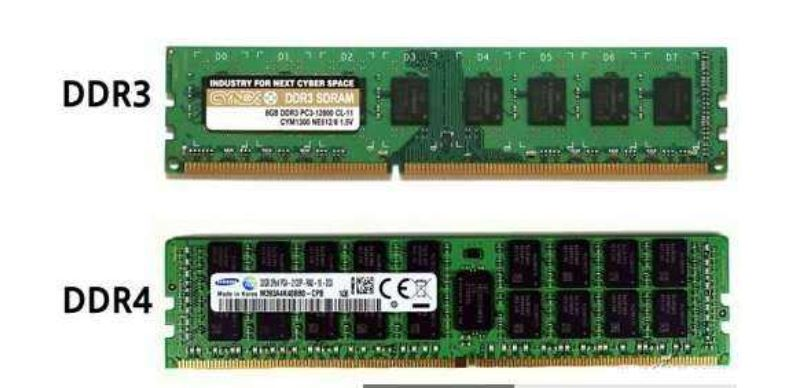
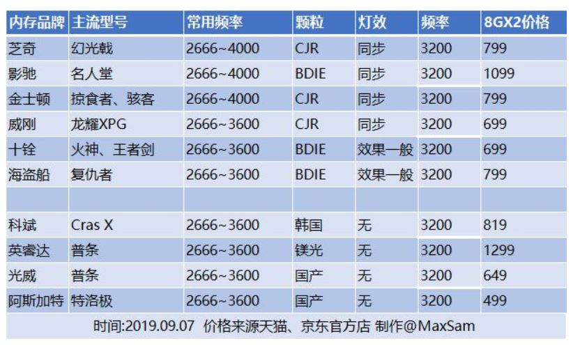

# A Technical Report about Memory

## Key Indicators

内存又称主存，是CPU能直接寻址的存储空间，一般采用半导体存储单元，包括随机存储器（RAM），只读存储器（ROM），以及高速缓存（CACHE）。

选择内存时考虑的主要是颗粒，时序，频率并且选择容量，品牌则作为辅助参考。

#### 容量

内存容量越大，CPU就可以更简单的应付大量的数据。常见的有4GB，8GB，16GB等，根据机器和用途选择合适容量的内存。

#### 类型

可以简单理解为内存技术的版本。目前还有市场的内存规格有DDR3和DDR4，市面上的新平台所使用的基本都是DDR4内存，但也有一些老平台再用DDR3内存，它们的频率不同。过去的DDR和DDR2内存已经被彻底淘汰。DDR4内存的工作电压及功率比DDR3低，拥有更小的发热，提升了内存条的稳定性，基本不会出现发热引起的降频现象。

#### 颗粒

内存颗粒即内存芯片，厂商主要是三星镁光海力士三家。不同内存使用的颗粒厂商不太一样。

#### 频率

内存的频率越高，内存的读写速度、数据的传输速度就越快。
买内存条时看到的频率是内存条厂家保证的内存颗粒能承受的频率，但生产电脑主办的厂家为了保证内存能稳定工作，默认把访问频率设置为了2133或2400，如果想使用高频内存条要去主板BIOS里设置内存的频率，称内存超频。

由于AMD对内存频率比较敏感（特别是集成核显），最佳频率是3600hz。

#### 时序

是一个决定内存性能的重要参数，内存时序（Memory timings/RAM timings）是描述同步动态随机存取存储器（SDRAM）性能的四个参数：CL、TRCD、TRP和TRAS，单位为时钟周期。
CL是CAS Latency，越小延迟越小，一般DDR4的CL值在14-16就是一个不错的数值了，不少低延迟高超频能力的内存条还会将CL值压缩到11，这样的内存条延迟会更低，从而获得同频率下更好的性能。
TRCD是行列寻址之间的延迟，内存在读写刷新过程中是先进行行寻址，再进行列寻址，通过这样一个非常规律的方式进行读写刷新操作的，延迟越低性能久越好；
TRP是内存控制器的充电时间，因为内存条一旦断电就会失去所有数据，所以须通过内存控制器的充电来维持每一行数据的保存，TRP决定每一行的激活所需要时长，如果时间长了数据存储的速度就会变慢，所以是越小越好。
TRAS是“一行内存从有效到无效的时间长度”，时间长了会变得拖沓；时间短了则数据还没有传输完毕就草草断电了，容易引起数据损坏。故一般的数字都会稍微偏大来兼并保证安全和速度。

其中时序和频率有相互制约，频率大会导致时序变长。

## Vendors

#### 金士顿（Kingston）

成立时间：1987年
总部地点：美国
金士顿是现今全球最大的独立内存产品制造商，2015年拥有64.7%全球市场份额。
以性能为主的DRAM产品线名为HyperX，所有金士顿内存都享有终身保固服务。
品牌知名度高，但是贵。

#### 英睿达（Crucial）

成立时间：1978年
母公司：美光（Micron）
总部地点：美国
Crucial专注于销售采用美光芯片与技术制造的计算机内存、随身碟及固态硬盘产品，其铂胜（Ballistix）系列的内存拥有良好的超频效能

#### 威刚（ADATA）

是台湾一家内存应用产品厂商。营业初期系以内存（DRAM）模块为主要产品线，其后投入闪存应用产品之开发。
目前主要产品线，涵盖DRAM及NAND型闪存及外围应用产品领域，包含内存模块、快闪记忆碟、记忆卡、固态硬盘及外接式硬盘。

#### 芝奇（G.SKILL）

成立时间：1989年
总部地点：台湾
芝奇（G.SKILL）是一家台湾电脑硬件制造商，主要生产计算机内存、NAND型闪存与计算机外设商品。该公司的的目标客户是电脑发烧友，以其高性能内存而闻名。

#### 十铨（Team）

成立时间：1997年
总部地点：台湾
十铨科技股份有限公司(Team Group Inc.)是一家内存制造商，主要生产Team Group内存模块、各款记忆卡、随身碟、固态硬盘、行动外围产品及工规记忆储存产品。
此品牌以价格便宜受到了部分消费者的欢迎。

### 主流内存型号和品牌例举

（图片资料来源于互联网）

## My own comment

总体来说，当然是容量越大，频率高时序小的内存好。根据手机、笔记本、主机的不同，通常使用的内存容量频率也有所区别。系统对内存的需求也不同，例如之前在WIN7环境下，2GB内存与4GB内存差别很小，有些情况下甚至没有差别，这时如果想提高内存性能，光想着升级容量意义并不是很大。所以一般会考虑到机器具体功能需求选择合适容量和频率的内存。

## References

- [百度百科 内存词条](https://baike.baidu.com/item/内存/103614)

- [知乎 哪些品牌的内存值得购买]( https://www.zhihu.com/question/52625261)

- [科普内存条]( https://zhuanlan.zhihu.com/p/64435611)

- [组装电脑：如何选择内存？](https://zhuanlan.zhihu.com/p/83502558)
