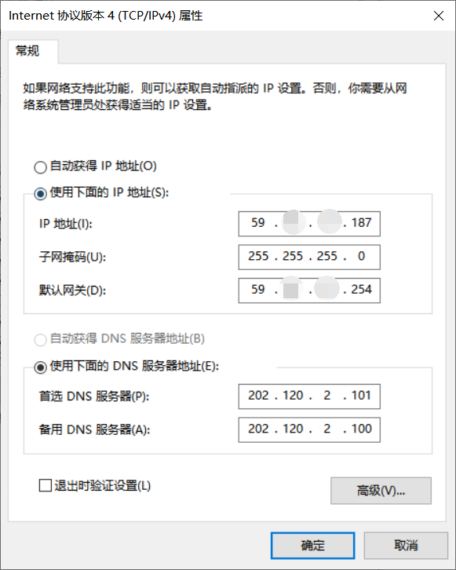

## Network

### 1.以校园网为载体，浅谈我们平时使用的网络知识
下图是在宿舍使用电脑直连寝室墙上端口上网时，电脑本身做的一些相关配置。依照图中对相关名词一一介绍

#### a. IP地址-- IP address
英文全称 InternetProtocol，IP地址是由IP协议规定，给因特网上每台计算机和其他设备都规定的一个统一的地址格式，以此来屏蔽物理地址的差异。相当于互联网中的门牌号。

IP地址由四段组成，每个字段是一个字节，即4个字节、  每个字节有8位，最大值是255(=256：0~255)。
IP地址由两部分组成，即网络地址和主机地址，二者是主从关系：

1. 网络号 net-id，它标志主机（或路由器）所连接到的网络，网络地址表示其属于互联网的哪一个网络
2. 主机号 host-id，它标志该主机（或路由器），主机地址表示其属于该网络中的哪一台主机。

  两级的 IP 地址可以记为：   IP 地址 ::= { <网络号>, <主机号>}   

简而言之就是：IP地址 = 网络号+主机号，IP地址与子网掩码经过一定规则运算后可以得到网络地址和主机地址。

IPv4地址分为A、B、C、D、E五类，出去特殊作用的D、E两类，剩下的A、B、C三类地址是我们常见的IP地址段。由于世界计算机日益发展，4个字节的地址渐渐不够用了，故在原基础产生了**公有地址**和**私有地址**的区分，公有地址需要向国际互联网信息中心申请注册，在IPv4地址协议中预留了3个IP地址段，作为**私有地址**，供组织机构内部使用。

| IP种类  | IP范围                     | 私有地址范围                 |
| ------- | -------------------------- | ---------------------------- |
| A类地址 | 1.0.0.0 --126.0.0.0        | 10.0.0.0--10.255.255.255     |
| B类地址 | 128.0.0.0--191.255.255.255 | 172.16.0.0--172.31.255.255   |
| C类地址 | 192.0.0.0--239.255.255.255 | 192.168.0.0--192.168.255.255 |

所以局域网在选取使用私有地址时，一般会按照实际需要容纳的主机数来选择私有地址段。常见的局域网由于容量小，一般选择C类的192.168.0.0作为地址段使用，一些大型企业就需要使用B类甚至A类地址段作为内部网络的地址段。

图中标注的是IPv4地址，相比于IPv4，有一种较为新型的IPv6网络，采用128位地址，不会再存在地址不够用的情况了。不过现在IPv6仍处于发展阶段，大部分网络通信还是以IPv4为主。

#### b. 子网掩码 -- Subnet mask
子网掩码(subnet mask)又叫网络掩码、地址掩码、子网络遮罩，它是一种用来指明一个IP地址的哪些位标识的是主机所在的子网，以及哪些位标识的是主机的位掩码。子网掩码不能单独存在，它必须结合IP地址一起使用。子网掩码只有一个作用，就是将某个IP地址划分成网络地址和主机地址两部分。子网掩码和IP地址共同使用，来确定网络地址和主机地址。

子网掩码、默认网关、MAC地址是需要一起解释的东西。
1. 计算机发送数据报的时候，知道对方IP是不够的，必须要知道接受者的MAC地址才可以。数据链路层上是没有IP地址概念的，只有发送者与接收者的MAC地址。
2. MAC地址与IP地址的关系，在以太网上通过ARP维护。ARP简单的工作原理为：
   2.1. 当有新设备加入网络时，会主动广播自己的MAC与IP。
   2.2. 当接收到2.1的信息的时候，本机建立一张对照表维护这个信息。
   2.3. 当需要发送数据报给一个IP时，到2.2建立的表中查询对应的MAC并发送。当查询不到信息的时候，广播一个查询申请，要求指定的IP的主机执行2.1动作，并在稍后重新执行本步骤。 

子网掩码结合本地IP地址后，用来确定目标IP是否在“逻辑上”与本计算机在同一个网络内（不管实际物理情况）。当目标地址**同网**（逻辑同网，即两个IP在与子网掩码进行AND计算后得出的网络名称相同），根据2.3策略直接发送数据；当目标地址不同网（逻辑不同网，即两个IP在与子网掩码进行AND计算后得出的网络名称不同），则根据2.3策略但将数据报发往默认网关IP对应的主机，由其负责路由代发。

#### c. 网关
网关实质上是一个网络通向其他网络的IP地址。比如有网络A和网络B，网络A:IP地址范围为“192.168.1.1~192. 168.1.254”，(其实这里就可以看出来，‘网络’这个词指的不是仅仅指一个ip啊等等，可以理解为‘一张网’) 子网掩码为255.255.255.0；
网络B:IP地址范围为“192.168.2.1~192.168.2.254”，子网掩码为255.255.255.0。

​在没有路由器的情况下，两个网络之间是不能进行TCP/IP通信的，即使是两个网络连接在同一台交换机（或集线器）上，TCP/IP协议也会根据子网掩码（255.255.255.0）判定两个网络中的主机处在不同的网络里。而要实现这两个网络之间的通信，则必须通过网关。如果网络A中的主机发现数据包的目的主机不在本地网络中，就把数据包转发给它自己的网关，再由网关转发给网络B的网关，网络B的网关再转发给网络B的某个主机（如附图所示）。网络A向网络B转发数据包的过程。

​只有设置好网关的IP地址，TCP/IP协议才能实现不同网络之间的相互通信。网关的IP地址是具有路由功能的设备的IP地址，具有路由功能的设备有路由器、启用了路由协议的服务器（实质上相当于一台路由器）、代理服务器（也相当于一台路由器）。

在和 Novell NetWare 网络交互操作的上下文中，网关在 Windows 网络中使用的服务器信息块 (SMB) 协议以及NetWare网络使用的 NetWare 核心协议 (NCP) 之间起着桥梁的作用。网关也被称为 IP路由器。

#### d. DNS
​DNS是指：域名服务器(Domain Name Server)。在Internet上域名与IP地址之间是一一对应的，域名虽然便于人们记忆，但机器之间只能互相认识IP地址，它们之间的转换工作称为域名解析，域名解析需要由专门的域名解析服务器来完成，DNS就是进行域名解析的服务器。
老师上课所提到过的“DNS绑架”，就可以理解为，原本想访问 www.google.com，但是由于我的DNS被侵入，域名并没有翻译为google所对应的IP地址(如: 93.123.23.1)，而是跳转到了黑客所设定的IP地址，在一个假页面来获取我的个人信息。
同理，DNS是域名到ip地之间的翻译，不需要网站域名的情况下也就不需要DNS了，这就是为什么当出现"QQ可以打开，但是打不开百度"时，要首先检查是不是DNS出现了错误。

#### e. mac地址
在申请校园网的时候，我们不仅要填上自己的个人信息，如学号手机号等，还要写一个mac地址。以下来自wiki：
*MAC地址用于在网络中唯一标示一个网卡，一台设备若有一或多个网卡，则每个网卡都需要并会有一个唯一的MAC地址*
那么就可以理解为，mac地址就是每一个网卡的身份证号码。
可是有会产生以下疑问：既然ip已经是用于规定每个设备相对于其他设备的标识了，那么为什么还需要mac地址呢？那或者，为什么不能只用mac地址，不再使用ip地址呢？
首先来回答第二个问题：mac地址没有类似“网段”的概念，那么每次通讯，我都要从248个地址中去找，太多了啊！而ip地址是后来定义的，与地域相关的，引入了“网段”的概念。就方便了不少。而在设备还没有 IP 地址的时候（或者分配 IP 地址的过程中），我们还需要用 MAC 地址来区分不同的设备。究其根本，是因特网没有覆盖完全，而mac可以视为除了因特网以外的网络（本例为以太网）的代表，我还有自己的用处，所以可以在使用过程中根据mac分配数据，包括将mac与ip进行翻译等等。
### 2. 硬件补充

#### a. 路由器

#### b. 交换机

#### c. 网卡

#### Reference

[ip地址、子网掩码、网关的解析](https://www.liupeng.mobi/archives/1127)
[路由器-wiki](https://en.wikipedia.org/wiki/Router_(computing))
[网关-wiki](https://zh.wikipedia.org/wiki/%E7%BD%91%E5%85%B3)
[知乎：为什么有了ip还要有mac地址](https://www.zhihu.com/question/21546408)