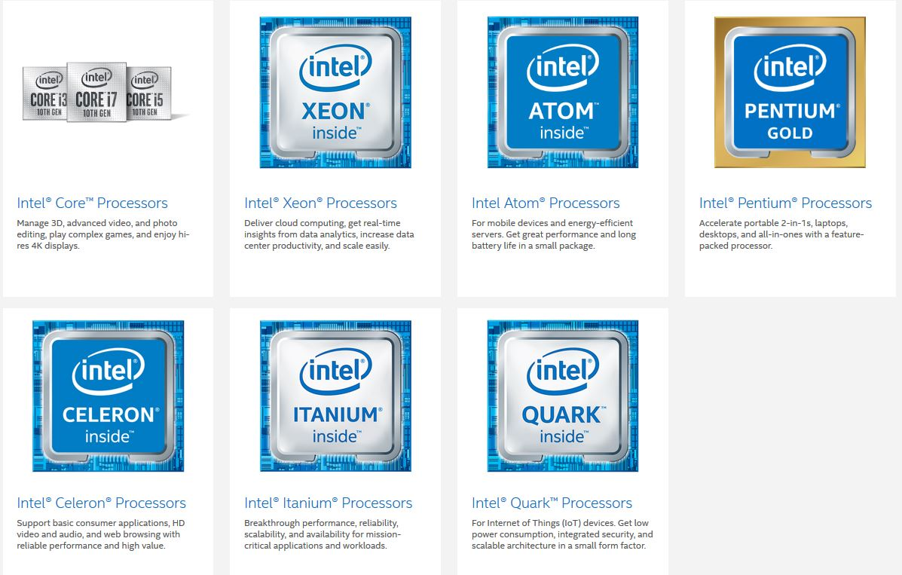
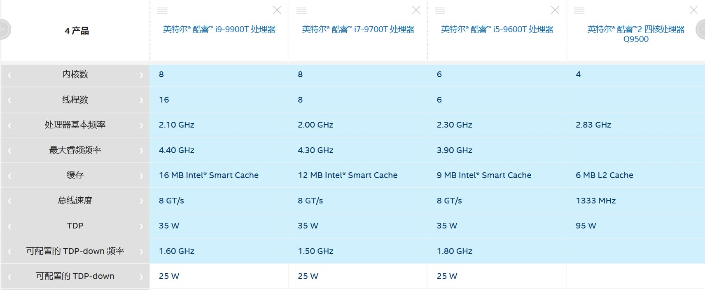
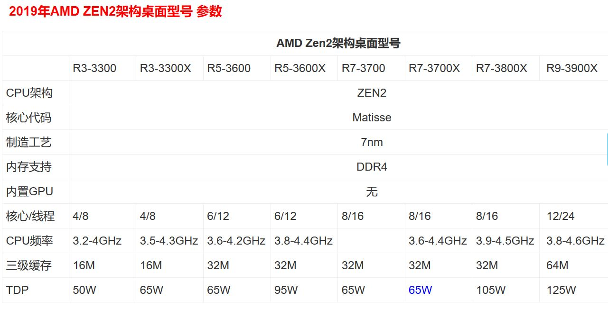
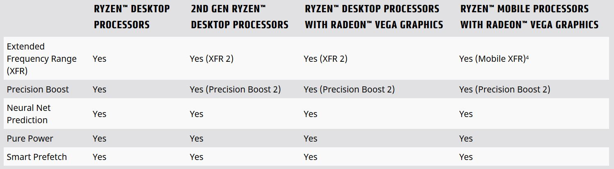
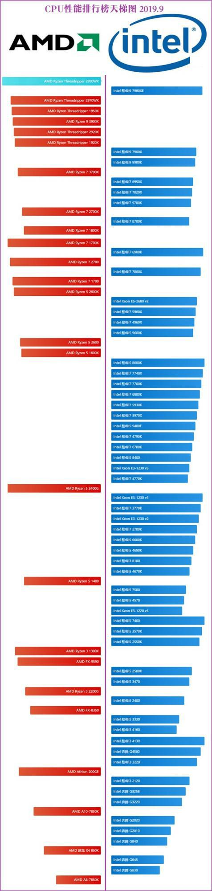
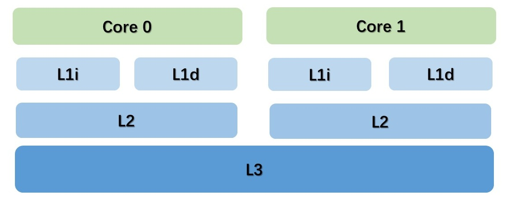
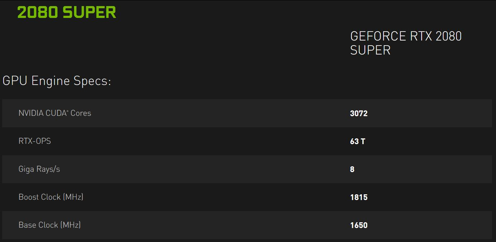
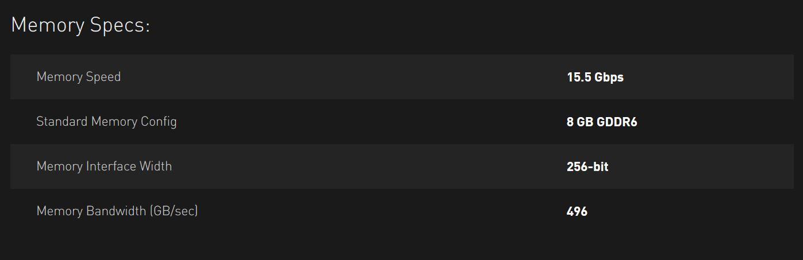
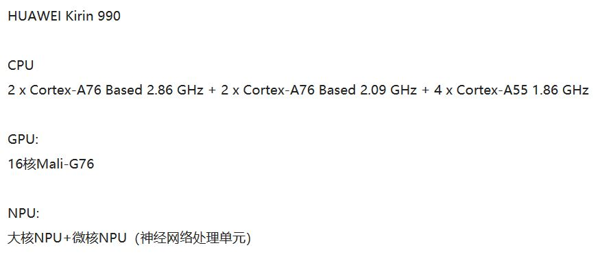
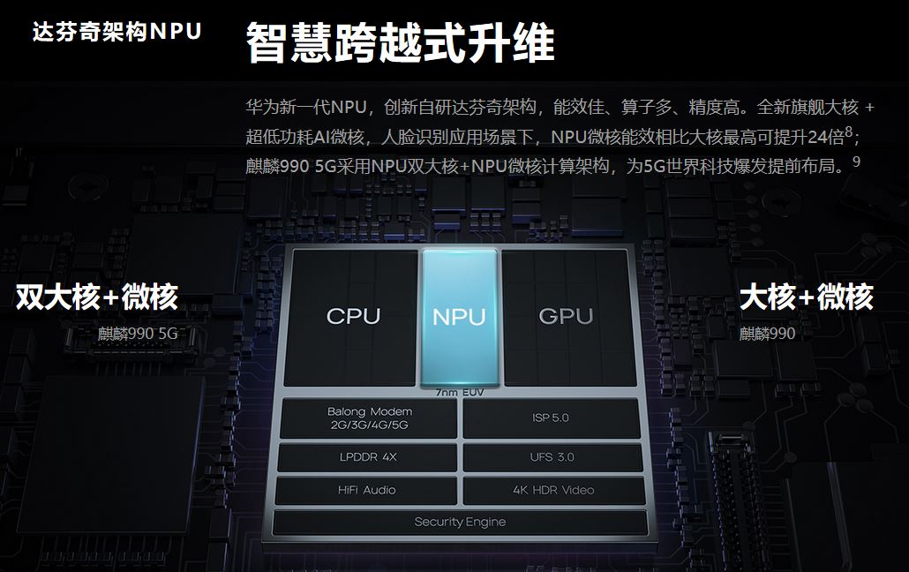

# xPU

## CPU (Central Processing Unit)

> A **CPU**, also called a central processor or main processor, is the electronic circuitry within a computer that carries out the instructions of a computer program by **performing the basic arithmetic, logic, controlling, and input/output (I/O) operations** specified by the instructions.
> *[Wikipedia]*

### Vendors of CPU

#### Intel

+ For diffrent usage
  + enterprise-scale servers
  + IoT devices, laptops
  + desktops
  + workstations
  + mobile devices

  

+ Comparison of several Intel core chips

#### AMD

+ Product specification of the "Zen 2" core

+ Features of the "Zen 2" core:
  + Up to 15% more instructions-per-cycle2
  + 2X L3 cache capacity (up to 32MB)
  + 2X floating point throughput (256-bit)
  + 2X OpCache capacity (4K)
  + 2X Infinity Fabric bandwidth (512-bit)
  + New TAGE branch predictor

+ AMD SenseMI Technology
  

  + Extended Frequency Range (XFR)
    + Permits CPU speeds above and beyond ordinary Precision Boost limits
    + Clock speed scales with cooling performance
    + Fully automated; no user input required

  + Precision Boost
    + The AMD Ryzen™ processor monitors its own energy consumption and temperature.
    + When the processor knows it's running cool and quiet, it can raise clock speeds in precise 25MHz steps for any application

  + Neural Net Prediction
  
    Employs an artificial neural network to understand your applications and **anticipate the next** steps of your workflow in real time.

  + Pure Power

    + A sophisticated grid of smart sensors **monitors CPU temperature, resource usage and power draw**
    + Intelligent power optimization circuits
    + An advanced 14nm FinFET manufacturing technology

  + Smart Prefetch

    Sophisticated learning algorithms understand the inner workings of your applications and **anticipate what data they might need**. Smart Prefetch predictively brings that data into the AMD Ryzen™ processor for fast and responsive computing.

  
### Key Indicators of CPU

#### Clock Rate

> The clock signal is produced by an external oscillator circuit that generates **a consistent number of pulses each second** in the form of **a periodic square wave**.
>
> The frequency of the clock pulses **determines the rate at which a CPU executes instructions** and, consequently, **the faster the clock, the more instructions the CPU will execute each second**.

With the development of computer, the clock rate increases from the past **MHz** to the current **GHz**

#### Cache

> A CPU cache is a hardware cache used by the CPU of a computer to **reduce the average cost** (time or energy) to **access data from the main memory**.
>
> A cache is a **smaller**, **faster** memory, closer to a processor core, which stores copies of the data from frequently used main memory locations. Most CPUs have different independent caches, including **instruction** and **data** caches, where the data cache is usually organized as a hierarchy of more cache levels (L1, L2, L3, L4, etc.).
> *[wikipedia]*

schematic diagram of CPU cache

**General size** is in powers of two:

4, 8, 16 etc. KiB or MiB (for larger non-L1) sizes, although the IBM z13 has a 96 KiB L1 instruction cache.

#### Integer range

+ Determines the range of integer values it can directly operate on.
+ Affect the number of memory locations the CPU can directly address

word sizes are a power of two, for example 8, 16, 32 or 64 bits.
  
## GPU (Graphics Processing Unit)

> A **GPU** is a specialized electronic circuit designed to rapidly manipulate and alter memory to **accelerate the creation of images** in a frame buffer intended for output to a display device.
>*[wikipedia]*

### Characteristic of the GPU

+ PARALLEL
  
  Modern GPUs are very **efficient at manipulating computer graphics and image processing**.
  
  Their **highly parallel structure** makes them more efficient than general-purpose CPUs for algorithms that **process large blocks of data in parallel**.

  For example, matrix and vector operations.

  In research done by Indigo, it was found that while training deep learning neural networks, GPUs can be 250 times faster than CPUs.

  GPUs can reduce the burden of CPUs, improve the ability of display and speed up display.

### Vendors of GPU

> Many companies have produced GPUs under a number of brand names. In 2009, **Intel**, **Nvidia** and **AMD/ATI** were the market share leaders, with 49.4%, 27.8% and 20.6% market share respectively. However, those numbers include Intel's integrated graphics solutions as GPUs. Not counting those, **Nvidia** and **AMD** control nearly 100% of the market as of 2018. Their respective market shares are 66% and 33%.

#### VPU

Before 2018, ATI always referred to graphics processors as VPU, and it was not until AMD acquired ATI that its graphics chips officially adopted the name of GPU.

### Types of GPU for Different Usage

Most GPUs are designed for a specific usage, real-time 3D graphics or other mass calculations:

1. Gaming
    + GeForce GTX, RTX
    + Nvidia Titan X
    + AMD Radeon HD
    + AMD Radeon R5, R7, R9, RX, Vega and Navi series
2. Cloud Gaming
    + Nvidia Grid
    + AMD Radeon Sky
3. Workstation
    + Nvidia Quadro
    + Nvidia Titan X
    + AMD FirePro
    + AMD Radeon Pro
    + AMD Radeon VII
4. Cloud Workstation
    + Nvidia Tesla
    + AMD FireStream
5. Artificial Intelligence Cloud
    + Nvidia Tesla
    + AMD Radeon Instinct
6. Automated/Driverless car
    + Nvidia Drive PX

### Key Indicators of GPU

#### Number of Cores

CUDA Cores. Compute Unified Device Architecture is a computing platform manufactured by NVIDIA. It is a general parallel computing architecture which can solve complex computational problems.

Modern GPUs have a great many cores. Thus GPUs can do parallel computing fast.

For example, a GPU of NVIDIA, GeForce RTX 2080 SUPER, which has thousands of cores.

### Memory

Parallel computing processes large amounts of data, so the speed of access memory is important.

These are the memory specs of GeForce RTX 2080 SUPER

It has larger memory space and banwidth than CPU cache.

## OTHER xPU (in Alphabetical Order)

### APU (Accelerated Processing Unit)

> The AMD Accelerated Processing Unit (APU), formerly known as Fusion, is the marketing term for a series of 64-bit microprocessors from AMD, designed to **act as a CPU and GPU on a single die**.
> *[wikipedia]*

#### Architecture of AMD APUs

All on the same die using the same bus

+ AMD CPU modules
+ cache
+ a discrete-class graphics processor

### NPU (Neural-network Processing Unit)

#### Vendors

+ HUAWEI

  Built-in independent NPU
  + 麒麟970(Kirin 970 )
  + 麒麟980(Kirin 980 )
  + 麒麟990(Kirin 990 )

A special AI hardware processing unit

+ Process massive amounts of data
+ Reduce load for CPU, GPU and other architectures
+ Improve efficiency
+ Reduce energy consumption

The processing unit in the kirin 990

### TPU (Tensor Processing Unit)

> A tensor processing unit (TPU) is an AI accelerator application-specific integrated circuit (ASIC) developed by **Google** specifically **for neural network machine learning**. *[wikipedia]*

The chip has been specifically designed for Google's TensorFlow framework.

Compared to a GPU, it is designed for a **high volume** of **low precision** computation (e.g. as little as 8-bit precision) with more input/output operations per joule, and lacks hardware for rasterisation/texture mapping.

### More...

There are many other xPU that are not mentioned.

## Conclusion

The processing units in different types all aim at faster computation and processing larger amounts of data. Different companies have designed processing units with different characteristics for specific tasks they need solve.

Therefore, the appropriate xPU should be selected according to the different work content.

However, in addition to specific tasks, xPUs should  have the capacity to deal with more general problems so that it can be widely used and work with other xPUs.

## REFERENCE

[通俗易懂告诉你CPU/GPU/TPU/NPU...XPU都是些什么鬼？](https://www.sohu.com/a/200698604_160923)

[Central processing unit](http://wikipedia.moesalih.com/CPU)

[Information about Intel chips](https://ark.intel.com/content/www/cn/zh/ark.html#@Processors)

[AMD主流CPU参数对比 速查表（201902版）](http://www.365pcbuy.com/article-419.html)

[AMD - The "Zen" Core Architecture](https://www.amd.com/en/technologies/zen-core)

[AMD SenseMI Technology](https://www.amd.com/en/technologies/sense-mi)

[cpu天梯图2019年9月排行天梯图多版本](http://baijiahao.baidu.com/s?id=1643636014754025954&wfr=spider&for=pc)

[Graphics processing unit](http://wikipedia.moesalih.com/GPU)

[Vision processing unit](http://wikipedia.moesalih.com/Vision_processing_unit)

[知识干货: GPU关键参数和应用场景](https://blog.csdn.net/BtB5e6Nsu1g511Eg5XEg/article/details/99131756)

[GPU参数解释](https://www.xuebuyuan.com/3258326.html)

[百度百科 - CUDA](https://baike.baidu.com/item/CUDA/1186262?fr=aladdin)

[CUDA学习笔记（一）：浅析GPU计算——CPU和GPU的选择](https://blog.csdn.net/qq_36653505/article/details/81368376)

[NVIDIA® GeForce® RTX 2080 SUPER](https://www.nvidia.cn/geforce/graphics-cards/rtx-2080-super/)

[AMD Accelerated Processing Unit](http://wikipedia.moesalih.com/AMD_APU)

[百度百科 - 麒麟970](https://baike.baidu.com/item/%E9%BA%92%E9%BA%9F970/19823973?fr=aladdin)

[麒麟990系列](https://consumer.huawei.com/cn/campaign/kirin-990-series/)

[Tensor processing unit](http://wikipedia.moesalih.com/Tensor_processing_unit)
