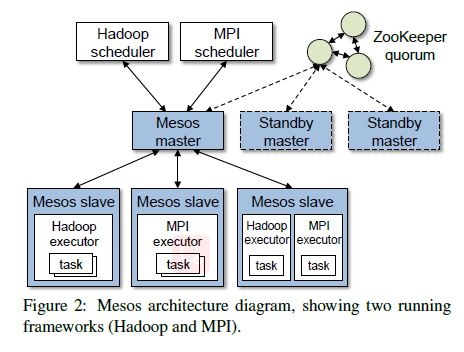

# Reading Notes for Mesos
#### Mesos: A Platform for Fine-Grained Resource Sharing in the Data Center
### Brief Introduction

Mesos shares resources in a fine-grained manner， allowing frameworks to achieve data locality by taking turns reading data stored on each machine.

Mesos decides how many resources to offer each framework, while frameworks decide which resources to accept and which computations to run on them.

The main design question for Mesos is how to build a scalable and efficient system that supports a wide array of both current and future frameworks.

### Mesos Need to Solve

1)Each framework will have different scheduling needs, based on its programming
model, communication pattern, task dependencies, and data placement. 

2)The scheduling system must scale to clusters of tens of thousands of nodes running
hundreds of jobs with millions of tasks. 

3)Because all the applications in the cluster depend on Mesos, the system must be fault-tolerant and highly available.

### Architecture of Mesos

Mesos consists of a master process that manages slave daemons running on each cluster node, and frameworks that run tasks on these slaves.

Each framework running on Mesos consists of two components:

1. A scheduler that registers with the master to be offered resources.

2. An executor process that is launched on slave nodes to run the framework’s tasks.

Mesos delegates allocation decisions to a pluggable allocation module, so that organizations can tailor allocation to their needs. So far, They implemented two allocation modules: one that performs fair sharing based on a generalization of max-min fairness for multiple resources; one that implements strict priorities.

Mesos provides performance isolation between framework executors running on the same slave by leveraging existing OS isolation mechanisms. Since these mechanisms are platform-dependent, we support multiple isolation mechanisms through pluggable isolation modules.

Here're API summary:

### Fault Tolerance of Mesos

They have designed the master to be soft state, so that a new master can completely reconstruct its internal state from information held by the slaves and the framework
schedulers.

To deal with scheduler failures, Mesos allows a framework to register multiple schedulers such that when one fails, another one is notified by the Mesos master to take over. Frameworks must use their own mechanisms to share state between their schedulers.

### Behavior & Distributed Scheduling Model & Environments

Consider three metrics:

1. Framework ramp-up time: time it takes a new framework to achieve its allocation;

2. Job completion time: time it takes a job to complete, assuming one job per framework;

3. System utilization: total cluster utilization.

The following is a table that summarizes the job completion times and system utilization for the two types of frameworks and the two types of task length distributions:

### Implementation of Mesos

They implemented Mesos in 10,000 lines of C++.
The system scales to 50,000 (emulated) nodes and uses ZooKeeper for fault tolerance. 

They have implemented four frameworks on top of Mesos. They have ported three existing cluster computing systems: Hadoop, the Torque resource scheduler, and the MPICH2 implementation of MPI.
None of these ports required changing these frameworks’ APIs, so all of them can run unmodified user programs. 

### Evaluation

Here evaluated Mesos through a series of experiments on the Amazon Elastic Compute Cloud (EC2). We begin with a macrobenchmark that evaluates how the system shares resources between four workloads, and go on to present a series of smaller experiments designed to evaluate overhead, decentralized scheduling, our specialized framework (Spark), scalability, and failure recovery.

This is benchmark workload:

This is Macrobenchmark Results:

There're also other results of test of Mesos which are shown in the article, here only show this two.

And to evaluate Mesos’ scalability, we emulated large clusters by running up to 50,000 slave daemons on 99 Amazon EC2 nodes, each with 8 CPU cores and 6 GB RAM. We used one EC2 node for the master and the rest of the nodes to run slaves. During the experiment, each of 200 frameworks running throughout the cluster continuously launches tasks, starting one task on each slave that it receives a resource offer for. Each task sleeps for a period of time based on a normal distribution with a mean of 30 seconds and standard deviation of 10s, and then ends. 

### Conclusion and Future Work

Mesos, a thin management layer that allows diverse cluster computing frameworks to efficiently share resources. Mesos is built around two design elements: a fine-grained sharing model at the level of tasks, and a distributed scheduling mechanism called resource offers that delegates scheduling decisions to the frameworks.

In future work, the workers plan to further analyze the resource offer model and determine whether any extensions can improve its efficiency while retaining its flexibility.
In particular, it may be possible to have frameworks give richer hints about offers they would like to receive. Nonetheless, they believe that below any hint system, frameworks should still have the ability to reject offers and to choose which tasks to launch on each resource, so that their evolution is not constrained by the hint language provided by the system.

