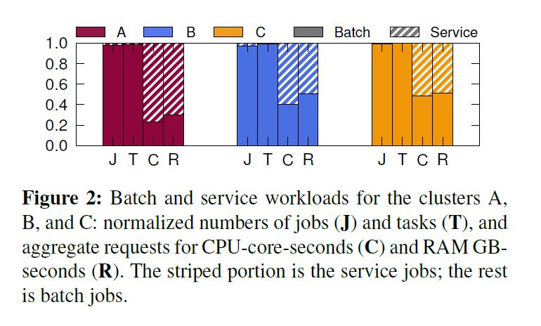
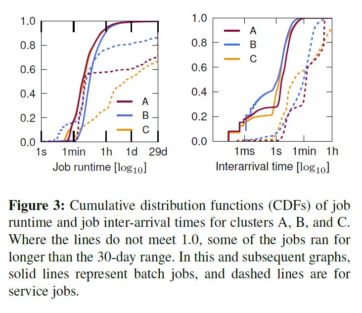
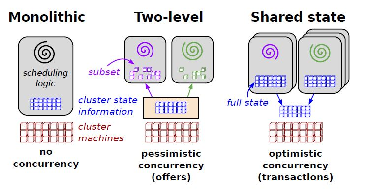

# Reading Notes "Omega: flexible, scalable schedulers for large compute clusters"

## 简介

**为什么有调度的问题？**

在集群中，让多个工作负载（任务）运行在同一个设备上，可以提高资源利用率和效率。更合适的调度策略和架构可以更好地利用资源，同时保证性能。

**这篇论文涉及到的三种调度器架构：**

+ Monolithtic schedulers
+ Two-level schedulers
+ Shared state schedulers
  
**集群的调度器的目标：**

+ 高资源利用率
+ 用户要求的位置约束
+ 快速决策
+ 不同程度的“公平性”
+ 高可用

**几种调度方法的对比**

Approach | Resource choice | Interference | Alloc. granularity | Cluster-wide policies
-|-|-|-|-
Monolithic | all available | none (serialized) | global policy | strict priority (preemption)
Statically partitioned | fixed subset | none (partitioned) | per-partition policy | scheduler-dependent
Two-level (Mesos) | dynamic subset | pessimistic | hoarding | strict fairness
Shared-state (Omege) | all available | optimistic | per-scheduler policy | free-for-all, priority preemption  

**工作负载不均匀**

不同的工作负载可以大致分为两类：long-running service jobs, batch jobs

这两种任务运行的时长、task的数量、占用的CPU和内存等资源比例都不太一样。例如，batch job运行时间比较短，而service jobs占用资源比例更大。

下面是论文中给出的batch jobs和service jobs对比的图表

调度应该考虑不同的工作负载，考虑实际情况下不同负载的比例

对于batch jobs，快速的、轻量级的处理方法更合适，因为执行时间短，花很多时间在调度上面是不划算的。

对于service jobs， 因为会运行很长时间，所以应该比较谨慎的进行调度，来保证可用性和性能。

## 3种调度架构对比

### Monolithic schedulers

单体的调度器不支持并行，对于不同的任务（batch jobs & service jobs）采用同样的策略。在单体的结构基础上实现对于不同类型的任务采取不同的调度算法是比较复杂和困难的。

在模拟真实工作负载的实验中，Monolithic schedulers分为了两种：*single-path*，对不同种类的任务执行同样的代码；*muti-path*，对batch jobs做更快的调度。随着决策时间增长到3-10s时，single-path的平均等待时间快速增长，调度器也很快达到饱和。muti-path的情况要好很多，但是batch jobs还是有可能等在需要较长决策时间的job后面，因为**没有并行**的处理。

### Two-level scheduling (Mesos)

Two-level scheduling 用一个中心的协调器将资源分配给每个子集群，每个子集群只能决定被分配的这部分资源怎么用。为了避免将同样的资源分给不同任务的冲突，子集群管理的资源是没有交集的。在任务是短生命周期的，可以很频繁的放弃被分配的资源时，这种结构是很好的。但是真实的工作负载并不是这种情况。

### Shared-state scheduling (Omega)

#### 实现

no central resource allocator

Each scheduler is given a **private, local, frequently-updated copy of cell state** (a resilient master copy of the resource allocations in the cluster)

The scheduler can see the entire state of the cell and has complete freedom to lay claim to any available cluster resources

Whether or not the transaction succeeds, the scheduler resyncs its local copy of cell state afterwards and, if necessary, re-runs its scheduling algorithm and tries again.

typically choose to use incremental trancastions

#### 特点

+ 高效

等待时间的增加是因为调度器之间产生冲突之后需要重新调度。但实验结果表明Omega的这种结构仍然可以保证service jobs的调度器性能。

对于batch jobs，采用了**负载均衡**的方式来提高性能。

+ 灵活的扩展性
  
  增加资源的策略

  + max-parallelism
  + global cap
  + relative job size
  
## 总结

Shared-state scheduling 虽然在处理冲突的时候比Two-level scheduling 多做了一些重复的工作，处理冲突的时候要重新调度，但是在真实情况中发现这个代价是可接受的，而且还提供了很好的性能。Shared-state scheduling 可以针对不同的任务使用不同策略的调度器，可以利用MapReduce scheduler调整资源的数量，增加了它的灵活性和可扩展性。
