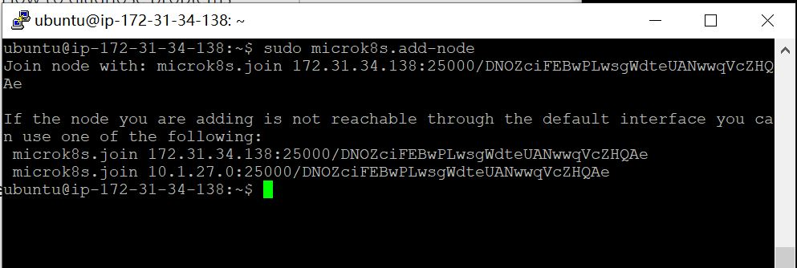
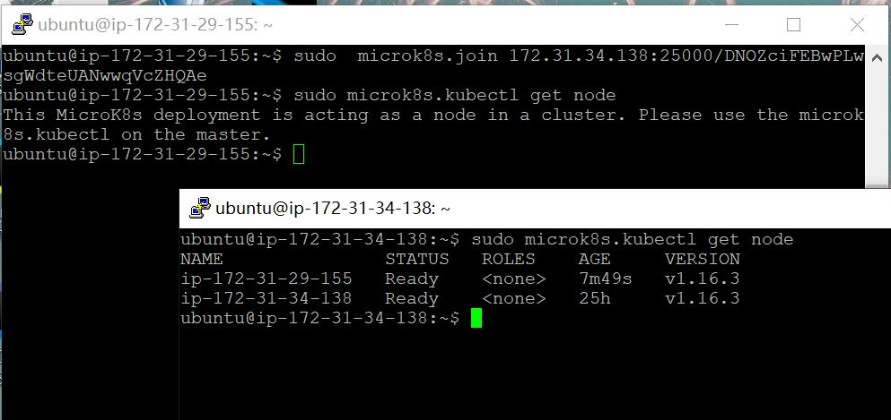
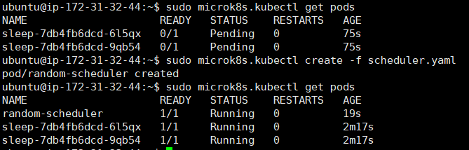

## Random Scheduler
这是一个专门针对于hello-node应用的schduler，用go语言编写。参考资料为[creating a custom scheduler](https://developer.ibm.com/articles/creating-a-custom-kube-scheduler/),以及[k8s-custome-schduler](https://banzaicloud.com/blog/k8s-custom-scheduler/)
#### 集群的搭建
我们小组搭建集群尝试了三种方式。第一种是kubernetes官网上有的minikube，这个方法非常简单，但是问题在于只能支持单node，不符合要求。然后我们还尝试了两种方案，kind(Kubernetes IN Docker)以及Microk8s。kind是一种通过docker搭建虚拟机的kubernetes实现方式，他的好处是一台机器上我们可以通过这个方法运行多个node，本次实验甚至可以在本地完成；缺点是kind要求至少8GB的内存，配置要求实在是太高了。这里贴一个kind的配置文件，可以在一台机器上配置两个节点:
```yaml
# this config file contains all config fields with comments
# NOTE: this is not a particularly useful config file
kind: Cluster
apiVersion: kind.sigs.k8s.io/v1alpha3
# patch the generated kubeadm config with some extra settings
kubeadmConfigPatches:
- apiVersion: kubelet.config.k8s.io/v1beta1
  kind: KubeletConfiguration
  evictionHard:
    nodefs.available: "0%"
# patch it further using a JSON 6902 patch
kubeadmConfigPatchesJson6902:
- group: kubeadm.k8s.io
  version: v1beta2
  kind: ClusterConfiguration
  patch: |
    - op: add
      path: /apiServer/certSANs/-
      value: my-hostname
# 1 control plane node and 1 worker
nodes:
# the control plane node config
- role: control-plane
# the three workers
- role: worker
``` 
最后实验我们用的是microk8s，用两个ubuntu实例搭建了集群。（参考：[在windows上连接实例](https://docs.aws.amazon.com/zh_cn/AWSEC2/latest/UserGuide/putty.html), [microk8s](https://microk8s.io/docs/clustering))

在AWS上申请了两个ubuntu实例，在两个实例中都安装microk8s

```
$ sudo snap install microk8s --classic --channel=1.16/stable
```

选一个作为master节点，在terminal输入
```
$ sudo microk8s.add-node
```
输入这条命令后会看到如下结果，将其中一行作为命令在另一个实例中输入，就实现了一个双节点的集群。其中需要在AWS console中给对应安全组添加入站规则，使它的端口可以被外部访问到。

在master节点中get node可以看到有两个节点


#### A custom scheduler
这个做的和老师讲的extender的那种scheduler有一点点区别，这是一个纯custom的scheduler。代码在[这里](https://github.com/llIllIllIlllIll/naive-kube-scheduler)。部署的过程是这样子的：
先把这个go应用打包成一个单独的容器，并且加以验证：
顺便说一句，这里打包失败了很多次，后来我才发现原因是AWS默认的服务器配置太烂...换了一个Large版本的实例就可以了。
```shell
ubuntu@ip-172-31-92-34:~/random-scheduler$ sudo docker build -t softpudding/random-scheduler .
```
打包完之后我直接上传到了个人的dockerhub里，需要在kubernetes要用的时候直接写 "docker.io/softpudding/random-scheduler"就可以了。
这个scheduler实现的非常非常非常简单，简单来说是哪个node可以用我就用哪个，完全不去做priority、filter之类的比较，监听程序看到哪个就用哪个。
实验过程用到两个配置文件，一个配置scheduler一个配置工作用的pod。
第一个文件先部署两个working pod：
``` yaml
apiVersion: apps/v1
kind: Deployment
metadata:
  name: sleep
spec:
  replicas: 2
  selector:
    matchLabels:
      app: sleep
  template:
    metadata:
      labels:
        app: sleep
    spec:
      schedulerName: random-scheduler
      containers:
      - name: sleep
        image: tutum/curl
        command: ["/bin/sleep","infinity"]
        imagePullPolicy: IfNotPresent
```
不过这两个working pod基本上是什么都不干的；他们存在的意义只是验证我的scheduler有没有部署成功。如果没有的话，这两个pod会一直处于pending的状态。
第二个配置文件是一个部署scheduler的deployment：
``` yaml
apiVersion: apps/v1
kind: Deployment
metadata:
  name: random-scheduler
  labels:
    app: random-scheduler
spec:
  replicas: 1
  selector:
    matchLabels:
      app: random-scheduler
  template:
    metadata:
      labels:
        app: random-scheduler
    spec:
      serviceAccount: random-scheduler
      containers:
        - name: random-scheduler
          image: softpudding/random-scheduler
          imagePullPolicy: Always
```
这里image部分设置成我自己的scheduler就可以了。
实验的时候命令：
先创造两个working pod
``` shell
sudo kubectl create -f sleep.yaml
```
然后查看发现这两个pod现在处于pending的状态。
接着deploy我们的scheduler，三个pod都正常running。

#### Build-in Scheduler
以下是用k8s自带的scheduler进行work pod的调度。（在此感谢柳哥支持）
首先是scheduler-config
```shell
apiVersion: v1
kind: ConfigMap
metadata:
  name: my-scheduler-config
  namespace: kube-system
data:
  config.yaml: |
    apiVersion: kubescheduler.config.k8s.io/v1alpha1
    kind: KubeSchedulerConfiguration
    schedulerName: my-kube-scheduler
    algorithmSource:
      policy:
        configMap:
          namespace: kube-system
          name: my-scheduler-policy
    leaderElection:
      leaderElect: false
      lockObjectName: my-kube-scheduler
      lockObjectNamespace: kube-system
---
apiVersion: v1
kind: ConfigMap
metadata:
  name: my-scheduler-policy
  namespace: kube-system
data:
 policy.cfg : |
  {
    "kind" : "Policy",
    "apiVersion" : "v1",
    "predicates" : [
      {"name" : "PodFitsHostPorts"},
      {"name" : "PodFitsResources"},
      {"name" : "NoDiskConflict"},
      {"name" : "MatchNodeSelector"},
      {"name" : "HostName"}
    ],
    "priorities" : [
      {"name" : "LeastRequestedPriority", "weight" : 1},
      {"name" : "BalancedResourceAllocation", "weight" : 1},
      {"name" : "ServiceSpreadingPriority", "weight" : 1},
      {"name" : "EqualPriority", "weight" : 1}
    ],
    "hardPodAffinitySymmetricWeight" : 10
  }
```
然后是scheduler.yaml的主体文件
```shell
apiVersion: v1
kind: Pod
metadata:
  creationTimestamp: null
  labels:
    component: kube-scheduler
    tier: control-plane
  name: my-kube-scheduler
  namespace: kube-system
spec:
  containers:
  - command:
    - kube-scheduler
    - --bind-address=127.0.0.1
    - --kubeconfig=/etc/kubernetes/scheduler.conf
    - --leader-elect=false
    - --config=/my-scheduler/config.yaml
    image: k8s.gcr.io/kube-scheduler:v1.15.0
    imagePullPolicy: IfNotPresent
    livenessProbe:
      failureThreshold: 8
      httpGet:
        host: 127.0.0.1
        path: /healthz
        port: 10251
        scheme: HTTP
      initialDelaySeconds: 15
      timeoutSeconds: 15
    name: kube-scheduler
    resources:
      requests:
        cpu: 100m
    volumeMounts:
    - mountPath: /etc/kubernetes/scheduler.conf
      name: kubeconfig
      readOnly: true
    - mountPath: /my-scheduler
      name: my-scheduler-config
  hostNetwork: true
  priorityClassName: system-cluster-critical
  volumes:
  - hostPath:
      path: /etc/kubernetes/scheduler.conf
      type: FileOrCreate
    name: kubeconfig
  - name: my-scheduler-config
    configMap:
      name: my-scheduler-config
status: {}
```
修改sleep.yaml文件的启用哪个scheduler的相关配置后，在命令行执行
```shell
kubectl apply -f config.yaml
kubectl apply -f schedule.yaml
```
就可以使用k8s自带scheduler对working pod进行调度。
